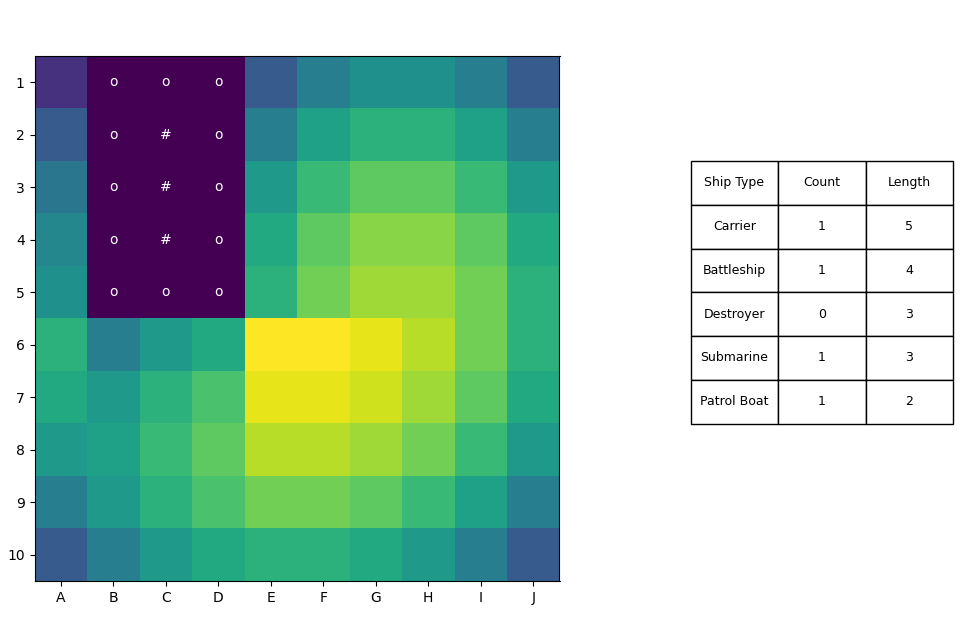

# Battleship Heuristic Solver

A tactical analysis tool for Battleship gameplay, utilizing Probability Density Mapping to determine optimal firing sequences based on remaining fleet data and known cell states.

## Core Features

- Heatmap Generation: Dynamic calculation of ship occupancy probabilities using iterative matrix scanning.
- Constraint Satisfaction: Real-time integration of Hit, Water, and Sunk states to filter valid ship placements.
- Automated Sinking Logic: Recursive identification of contiguous hits to transition units to the Sunk state, automatically flagging surrounding perimeters as Water (tactical exclusion).
- Weighted Heuristic (Stage 2): Aggressive prioritization of cells that explain existing hits, significantly increasing the precision of follow-up shots.

## Technical Stack

- Language: Python 3.14.3
- Libraries: NumPy (high-performance matrix operations), Matplotlib (GUI & data visualization).

## How the Solver works

The solver evaluates every theoretically possible placement for each remaining ship type across the grid.
$$P(s_{i,j}) = \sum_{L \in \text{Fleet}} \text{Valid}(\text{Segment}_L)$$
A segment is considered valid if no cell within it carries the Water or Sunk status. When "open" hits are present, segments overlapping these hits are weighted by a factor of 100 to accelerate target acquisition.

## Interface & Controls

The solver is interactive via mouse events on the Matplotlib canvas:
- Left Click: Mark cell as Water (Miss).
- Right Click: Mark cell as Hit.
- Middle Click (Scroll Wheel): Mark a hit as the "Sinking Blow" (triggers the sinking and perimeter-clearance logic).

## Methodology Note

This tool shifts the gameplay from guessing to a Constraint-Satisfaction Problem. By visualizing the underlying probability distribution, the user can maximize the expected value of every shot, minimizing the total number of turns required to clear the board.

## Setup & Installation

1. Repository klonen: `git clone https://github.com/GaiusJ/Battleship.git`
2. Abhängigkeiten installieren: `pip install -r requirements.txt`
3. Solver starten: `python BattleShipSolver.py`

## License & Terms of Use

This is a personal research project.

- **Personal & Educational Use:** Feel free to explore, learn from, and use this tool for private purposes.
- **Commercial Use:** Prohibited. If you intend to use this code, the heuristic logic, or any derivatives for commercial purposes or financial gain, please contact me directly for written permission.
